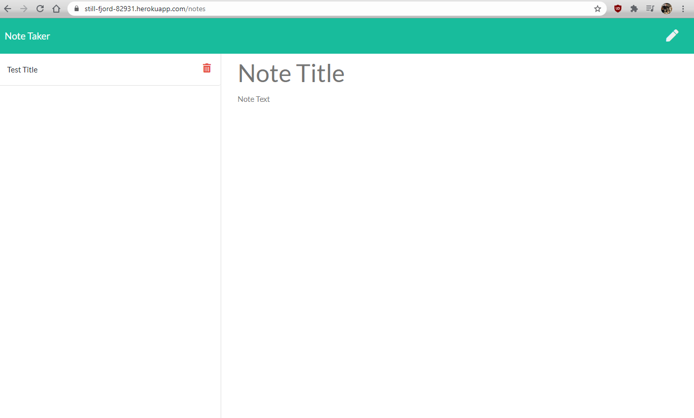

# Note-Taker

# Purpose

Note-taker allows a user to enter and save notes to a server. The user can enter a title for each note, save it, and refer back to it at a later date. The notes can be deleted as well.

# Usage

Click <a href="https://still-fjord-82931.herokuapp.com/">here</a> to get started.

# Preview

# Required Installation

## Express

## Util

## Path

## Crypto
